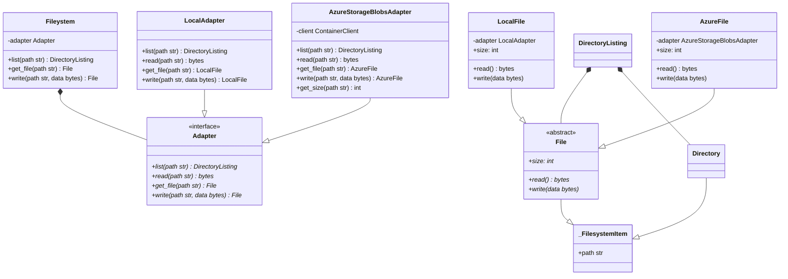

# Plugfs
This package aims to provide `async` implementation of a filesystem abstraction library.
Its purpose is to make working with filesystems more flexible.

We often find ourselves having to read and write files from our applications. We could do
this directly using modules that are capable of communicating with these storage systems,
however if for some reason we would like to use a different storage system, we would have
to rewrite that code.

Plugfs solves this, by providing an abstraction layer for your code.

## Install
Install in the usual way using your package manager, for example using `uv`:
```shell
uv add plugfs
```
or using `pip`:
```shell
pip install plugfs
```

## Filesystem abstraction



The idea behind this library is to provide an abstraction layer for your code. That way it doesn't matter what storage
backend is used.

We do this by setting up an adapter of choice and providing it to the `Filesystem` class.
In turn, we use the `Filesystem` object in our code to perform operations like reading and writing files.

If for whatever reason at some point we decide to use a different storage backend, all we would need to do is provide
the `Filesystem` with a different adapter.

## Usage

### Setting up the adapter
Setting up adapters can be a little messy when the adapter requires other objects to function.
We recommend using dependency injection to that, alternatively perhaps implement a factory.

#### Example
```python
from plugfs.filesystem import Filesystem
from plugfs.local import LocalAdapter


class LocalFilesystemFactory:
    def __call__(self) -> Filesystem:
        return Filesystem(LocalAdapter())
```
Or using Azure Blob Storage:
```python
import os

from azure.storage.blob.aio import ContainerClient

from plugfs.azure import AzureStorageBlobsAdapter
from plugfs.filesystem import Filesystem


class AzureBlobFilesystemFactory:
    def __call__(self) -> Filesystem:
        client = ContainerClient.from_connection_string(
            f"DefaultEndpointsProtocol=http;AccountName={os.getenv("AZURE_ACCOUNT_NAME")};"
            f"AccountKey={os.getenv("AZURE_ACCOUNT_KEY")};"
            f"BlobEndpoint={os.getenv("AZURE_STORAGE_URL")}/{os.getenv("AZURE_ACCOUNT_NAME")};",
            os.getenv("AZURE_CONTAINER", "default_container_name"),
        )
        return Filesystem(AzureStorageBlobsAdapter(client))
```

### Filesystem
Now that we have a way to produce a fully functional `Filesystem` object, we can start using it.

#### Make directories
```python
from plugfs.filesystem import Filesystem


async def make_a_directory(filesystem: Filesystem) -> None:
    await filesystem.makedirs("/tmp/path/to/new/directory")
```

#### Write file
```python
from plugfs.filesystem import Filesystem


async def write_file(filesystem: Filesystem) -> None:
    file = await filesystem.write(
        "/tmp/path/to/new/directory/file.txt",
        b"Hello!",
    )
```

#### Write file in chunks
```python
from typing import AsyncIterator

from plugfs.filesystem import Filesystem


async def iterator() -> AsyncIterator[bytes]:
    for chunk in [b"Hello", b" world", b"!"]:
        yield chunk


async def write_file(filesystem: Filesystem) -> None:
    file = await filesystem.write_iterator(
        "/tmp/path/to/new/directory/file.txt",
        iterator(),
    )
```

#### List directory
```python
from plugfs.filesystem import File, Filesystem


async def list_directory(filesystem: Filesystem) -> None:
    directory_listing = await filesystem.list("/tmp")
    for item in directory_listing:
        if isinstance(item, File):
            # It's a file
            ...
        else:
            # It's a directory
            ...
```

#### Read file data
```python
from plugfs.filesystem import Filesystem


async def read_file_data(filesystem: Filesystem) -> None:
    file = await filesystem.get_file("/tmp/file.txt")
    data_bytes = await file.read()
```

#### Read file data in chunks
```python
from plugfs.filesystem import Filesystem


async def read_file_data_in_chunks(filesystem: Filesystem) -> None:
    file = await filesystem.get_file("/tmp/file.txt")
    iterator = await file.get_iterator()

    async for chunk in iterator:
        ...
```

#### Delete file
```python
from plugfs.filesystem import Filesystem


async def delete_file(filesystem: Filesystem) -> None:
    file = await filesystem.get_file("/tmp/file.txt")
    await file.delete()
```

#### Delete file using only path
```python
from plugfs.filesystem import Filesystem


async def delete_file_using_path(filesystem: Filesystem) -> None:
    await filesystem.delete("/tmp/file.txt")
```

## Development
For development of this package we provide a container setup.

### Building the image
```shell
docker compose build
```

### Starting containers
```shell
docker compose run --rm plugfs sh
```

This will also open a shell where we can run our dev tools:
```shell
uv run mypy .
uv run black
uv run isort .
uv run pytest
```
